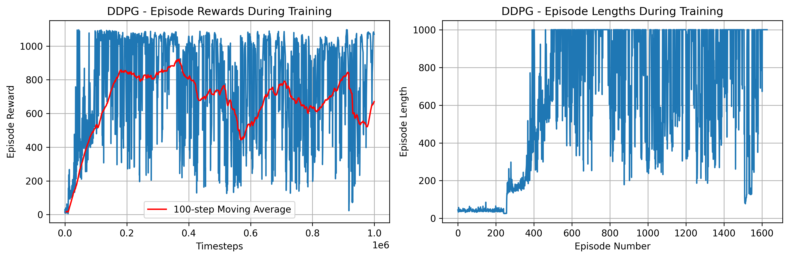
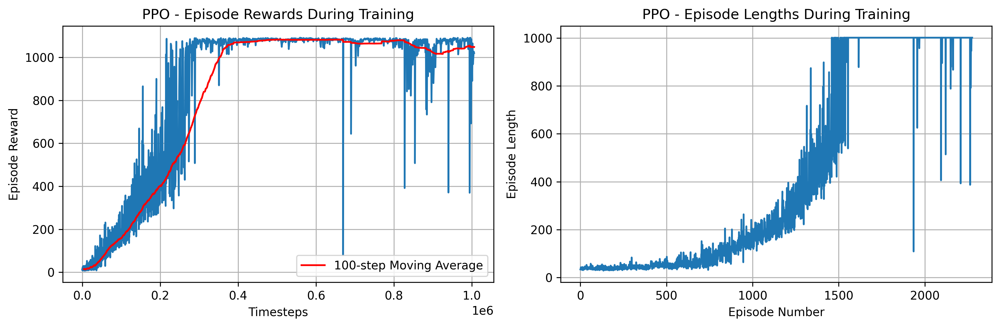
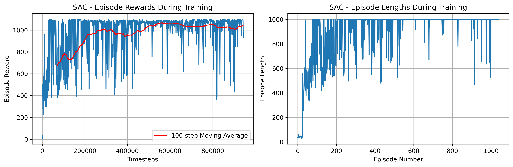

# Cart Double Pendulum Multi-Algorithm Reinforcement Learning

[](https://www.python.org/downloads/)
[](https://pytorch.org/)
[](https://stable-baselines3.readthedocs.io/)
[](LICENSE)

A reinforcement learning project that trains an agent to balance a double pendulum on a cart using multiple algorithms including PPO (Proximal Policy Optimization), SAC (Soft Actor-Critic), and DDPG (Deep Deterministic Policy Gradient) with pygame visualization.

## 🎯 Training Results

### Before Training (Random Policy)


### After Training (PPO Policy)


## 🎯 Project Overview

This project implements a cart with double pendulum physics simulation using pygame and trains an intelligent agent using PPO reinforcement learning algorithm to control the cart movement to maintain the balance of the double pendulum system.

The system consists of:
- **Cart**: Can move horizontally on a track with two wheels
- **Double Pendulum**: Two connected pendulum rods mounted on top of the cart
- **Control Objective**: Balance both pendulum rods in upright position by controlling horizontal cart movement

### Key Features
- **Real-time Physics Simulation**: High-precision physics modeling using pygame with fourth-order Runge-Kutta integration
- **Multi-Algorithm Support**: Choose from PPO, SAC, or DDPG algorithms for training
- **PPO (Proximal Policy Optimization)**: On-policy algorithm with stable performance
- **SAC (Soft Actor-Critic)**: Off-policy algorithm with entropy regularization for exploration
- **DDPG (Deep Deterministic Policy Gradient)**: Off-policy algorithm for continuous control
- **Comprehensive Visualization**: Real-time rendering and training progress monitoring
- **Multi-mode Demonstration**: Random control, PD controller, keyboard control for comparison
- **Configurable Parameters**: Adjustable environment and training parameters
- **TensorBoard Integration**: Detailed training metrics and visualization for each algorithm

## 🚀 Quick Start

### Requirements
- Python 3.8+
- GPU support recommended (CUDA optional)
- Operating system with graphics support

### Installation

1. **Clone the repository:**
    ```bash
    git clone https://github.com/your-username/Cart-Double-Pendulum-PPO-RL.git
    cd Cart-Double-Pendulum-PPO-RL
    ```

2. **Create virtual environment:**
    ```bash
    python -m venv venv
    source venv/bin/activate  # Linux/Mac
    # or
    venv\Scripts\activate  # Windows
    ```

3. **Install dependencies:**
    ```bash
    pip install -r requirements.txt
    ```

### Usage

**Quick Start:**
```bash
python start.py
```

**Train with Different Algorithms:**
```bash
# Train with PPO (default)
python train.py --mode train --algorithm PPO

# Train with SAC
python train.py --mode train --algorithm SAC

# Train with DDPG
python train.py --mode train --algorithm DDPG

# Custom training timesteps
python train.py --mode train --algorithm PPO --timesteps 500000
```

**Test Trained Models:**
```bash
# Test PPO model
python train.py --mode test --algorithm PPO --episodes 5

# Test SAC model
python train.py --mode test --algorithm SAC --episodes 5

# Test DDPG model
python train.py --mode test --algorithm DDPG --episodes 5

# Test with custom model path
python train.py --mode test --model_path models/ppo/custom_model.zip --algorithm PPO
```

**View Training Results:**
```bash
# View PPO training results
python train.py --mode plot --algorithm PPO

# View SAC training results
python train.py --mode plot --algorithm SAC

# View DDPG training results
python train.py --mode plot --algorithm DDPG
```

**Demo Environment:**
```bash
python demo.py
```

## 📁 Project Structure
```
Cart-Double-Pendulum-PPO-RL/
├── double_pendulum_env.py    # Cart double pendulum environment implementation
├── train.py                  # Training and testing script (multi-algorithm support)
├── demo.py                   # Demonstration script
├── start.py                  # Quick start script
├── requirements.txt          # Project dependencies
├── README.md                 # Project documentation
├── assets/                   # Static resources
│   ├── training_results.png  # Training performance plots
│   ├── before.gif            # Before training animation
│   └── after.gif            # After training animation
├── models/                   # Trained model checkpoints
│   ├── ppo/                  # PPO models
│   │   ├── best_model.zip
│   │   └── cart_double_pendulum_ppo_final.zip
│   ├── sac/                  # SAC models
│   │   ├── best_model.zip
│   │   └── cart_double_pendulum_sac_final.zip
│   └── ddpg/                 # DDPG models
│       ├── best_model.zip
│       └── cart_double_pendulum_ddpg_final.zip
├── logs/                     # Training logs (algorithm-specific)
│   ├── ppo/                  # PPO training logs
│   ├── sac/                  # SAC training logs
│   └── ddpg/                 # DDPG training logs
└── tensorboard_logs/         # TensorBoard logs
    ├── PPO/                  # PPO training sessions
    ├── SAC/                  # SAC training sessions
    └── DDPG/                 # DDPG training sessions
```


## 📈 Experimental Results (Multi-Algorithm Comparison)

### DDPG Training Curves


### PPO Training Curves


### SAC Training Curves


## 🔧 Environment Specification

### State Space (6-dimensional)
- `x`: Cart position (m)
- `x_dot`: Cart velocity (m/s)
- `theta1`: First pendulum angle (radians from vertical)
- `theta1_dot`: First pendulum angular velocity (rad/s)
- `theta2`: Second pendulum angle (radians from vertical)
- `theta2_dot`: Second pendulum angular velocity (rad/s)

### Action Space
- **Continuous Action**: Horizontal force applied to cart (normalized [-1, 1])

### Reward Function
- **Upright Reward**: High reward when both pendulums are near vertical
- **Position Penalty**: Penalty for cart deviation from center
- **Velocity Penalty**: Penalty for excessive velocities
- **Survival Reward**: Small positive reward for each time step

### Physical Parameters
- **Gravity**: 9.81 m/s²
- **Cart Mass**: 0.1 kg
- **Pendulum Masses**: 2.0 kg, 0.5 kg
- **Pendulum Lengths**: 0.5 m, 1.2 m
- **Maximum Force**: 20.0 N
- **Track Length**: 8.0 m
- **Time Step**: 0.01 s

### Termination Conditions
- Maximum steps reached (1000 steps)
- Cart exceeds track boundaries (±4.0 m)
- Pendulum angles too large (±π rad)
- Excessive velocities
- Pendulum collision with ground

## 🔧 Configuration

### Training Parameters

#### PPO Configuration
```python
learning_rate = 3e-4
n_steps = 2048
batch_size = 64
n_epochs = 10
gamma = 0.99
gae_lambda = 0.95
clip_range = 0.2
ent_coef = 0.01
```

#### SAC Configuration
```python
learning_rate = 3e-4
buffer_size = 1000000
learning_starts = 10000
batch_size = 256
tau = 0.005
gamma = 0.99
train_freq = 1
gradient_steps = 1
ent_coef = "auto"  # Auto-tuned entropy coefficient
```

#### DDPG Configuration
```python
learning_rate = 1e-3
buffer_size = 1000000
learning_starts = 10000
batch_size = 128
tau = 0.005
gamma = 0.99
train_freq = 1
gradient_steps = 1
action_noise = NormalActionNoise(mean=0, sigma=0.1)
```

### Environment Parameters
```python
# Physical Parameters
cart_mass = 0.1        # kg
pendulum1_mass = 2.0   # kg
pendulum2_mass = 0.5   # kg
pendulum1_length = 0.5 # m
pendulum2_length = 1.2 # m
max_force = 20.0       # N
```

## 🔧 Usage Examples

### Basic Training with Different Algorithms
```python
from train import train_cart_double_pendulum

# Train with PPO (default)
model, eval_env = train_cart_double_pendulum(algorithm="PPO")

# Train with SAC
model, eval_env = train_cart_double_pendulum(algorithm="SAC")

# Train with DDPG
model, eval_env = train_cart_double_pendulum(algorithm="DDPG")

# Custom timesteps
model, eval_env = train_cart_double_pendulum(
    algorithm="SAC", 
    total_timesteps=500000
)
```

### Custom Environment
```python
from double_pendulum_env import CartDoublePendulumEnv

# Create custom environment
env = CartDoublePendulumEnv(
    render_mode="human",
    max_steps=2000
)
```

### Load and Test Trained Models
```python
from stable_baselines3 import PPO, SAC, DDPG

# Load PPO model
ppo_model = PPO.load("models/ppo/cart_double_pendulum_ppo_final.zip")

# Load SAC model
sac_model = SAC.load("models/sac/cart_double_pendulum_sac_final.zip")

# Load DDPG model
ddpg_model = DDPG.load("models/ddpg/cart_double_pendulum_ddpg_final.zip")

# Test any model
obs, _ = env.reset()
action, _ = ppo_model.predict(obs, deterministic=True)
```

### Algorithm Selection Guide
```python
# Choose algorithm based on your needs:

# For stable training and learning RL basics:
model = train_cart_double_pendulum(algorithm="PPO")

# For sample efficiency and exploration:
model = train_cart_double_pendulum(algorithm="SAC")

# For deterministic policies and fast convergence:
model = train_cart_double_pendulum(algorithm="DDPG")
```

## 📊 Training Monitoring

### TensorBoard
Monitor training progress in real-time for different algorithms:
```bash
# View all algorithms
tensorboard --logdir=tensorboard_logs

# View specific algorithm
tensorboard --logdir=tensorboard_logs/PPO
tensorboard --logdir=tensorboard_logs/SAC
tensorboard --logdir=tensorboard_logs/DDPG

# Compare algorithms
tensorboard --logdir=tensorboard_logs --port=6006
```

### Training Analytics
- Episode rewards progression
- Policy loss and value function loss
- Entropy coefficient tracking
- Learning rate scheduling
- Environment interaction statistics

## 🤝 Contributing

Contributions are welcome! Please feel free to submit issues or pull requests.

### How to Contribute

1. Fork this repository
2. Create a feature branch (`git checkout -b feature/AmazingFeature`)
3. Commit your changes (`git commit -m 'Add some AmazingFeature'`)
4. Push to the branch (`git push origin feature/AmazingFeature`)
5. Open a Pull Request

## 📄 License

This project is licensed under the MIT License - see the [LICENSE](LICENSE) file for details.

## 🙏 Acknowledgments

- OpenAI Gym/Gymnasium for environment interfaces
- Stable-Baselines3 for PPO implementation
- Pygame for physics simulation and visualization
- PyTorch for deep learning backend

## 📞 Contact

For questions or suggestions, please:
- Submit an issue on GitHub
- Contact the maintainer directly

## 📚 Related Resources

### Algorithm Papers
- [PPO Paper](https://arxiv.org/abs/1707.06347) - Proximal Policy Optimization Algorithms
- [SAC Paper](https://arxiv.org/abs/1801.01290) - Soft Actor-Critic: Off-Policy Maximum Entropy Deep RL
- [DDPG Paper](https://arxiv.org/abs/1509.02971) - Continuous Control with Deep Reinforcement Learning

### Documentation & Resources
- [Stable-Baselines3 Documentation](https://stable-baselines3.readthedocs.io/)
- [Gymnasium Documentation](https://gymnasium.farama.org/)
- [Classical Control Problems](https://gym.openai.com/envs/#classic_control)
- [RL Algorithm Comparison](https://stable-baselines3.readthedocs.io/en/master/guide/algos.html)

## ⭐ Project History

If you find this project useful, please consider giving it a star on GitHub!
[](https://star-history.com/#Kwen-Chen/Cart-Double-Pendulum-PPO-RL&Date)
---

