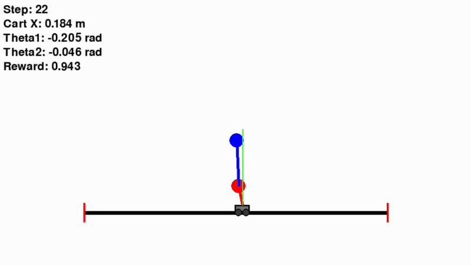
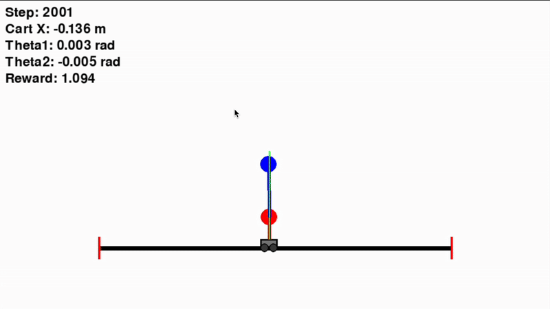
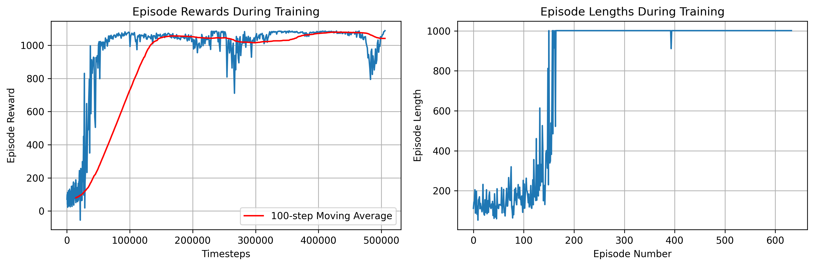

# Cart Double Pendulum PPO Reinforcement Learning

[](https://www.python.org/downloads/)
[](https://pytorch.org/)
[](https://stable-baselines3.readthedocs.io/)
[](LICENSE)

A reinforcement learning project that trains an agent to balance a double pendulum on a cart using PPO (Proximal Policy Optimization) algorithm with pygame visualization.

## 🎯 Training Results

### Before Training (Random Policy)


### After Training (PPO Policy)



## 🎯 Project Overview

This project implements a cart with double pendulum physics simulation using pygame and trains an intelligent agent using PPO reinforcement learning algorithm to control the cart movement to maintain the balance of the double pendulum system.

The system consists of:
- **Cart**: Can move horizontally on a track with two wheels
- **Double Pendulum**: Two connected pendulum rods mounted on top of the cart
- **Control Objective**: Balance both pendulum rods in upright position by controlling horizontal cart movement

### Key Features
- **Real-time Physics Simulation**: High-precision physics modeling using pygame with fourth-order Runge-Kutta integration
- **PPO Reinforcement Learning**: Advanced policy gradient method for continuous control
- **Comprehensive Visualization**: Real-time rendering and training progress monitoring
- **Multi-mode Demonstration**: Random control, PD controller, keyboard control for comparison
- **Configurable Parameters**: Adjustable environment and training parameters
- **TensorBoard Integration**: Detailed training metrics and visualization

## 🚀 Quick Start

### Requirements
- Python 3.8+
- GPU support recommended (CUDA optional)
- Operating system with graphics support

### Installation

1. **Clone the repository:**
    ```bash
    git clone https://github.com/your-username/Cart-Double-Pendulum-PPO-RL.git
    cd Cart-Double-Pendulum-PPO-RL
    ```

2. **Create virtual environment:**
    ```bash
    python -m venv venv
    source venv/bin/activate  # Linux/Mac
    # or
    venv\Scripts\activate  # Windows
    ```

3. **Install dependencies:**
    ```bash
    pip install -r requirements.txt
    ```

### Usage

**Quick Start:**
```bash
python start.py
```

**Train the Model:**
```bash
python train.py --mode train
```

**Test Trained Model:**
```bash
python train.py --mode test --episodes 5
```

**View Training Results:**
```bash
python train.py --mode plot
```

**Demo Environment:**
```bash
python demo.py
```

## 📁 Project Structure
```
Cart-Double-Pendulum-PPO-RL/
├── double_pendulum_env.py    # Cart double pendulum environment implementation
├── train.py                  # Training and testing script
├── demo.py                   # Demonstration script
├── start.py                  # Quick start script
├── requirements.txt          # Project dependencies
├── README.md                 # Project documentation
├── assets/                   # Static resources
│   ├── training_results.png  # Training performance plots
│   ├── before.gif            # Before training animation
│   └── after.gif            # After training animation
├── models/                   # Trained model checkpoints
│   ├── best_model.zip        # Best performing model
│   └── cart_double_pendulum_ppo_final.zip
├── logs/                     # Training logs
│   ├── *.monitor.csv         # Episode monitoring data
│   └── *.log                 # Training logs
└── tensorboard_logs/         # TensorBoard logs
    └── PPO_*/                # PPO training sessions
```

## 📈 Experimental Results

### Performance Metrics
- **Maximum Episode Length**: 1000+ steps
- **Average Reward**: 900+ (trained model)
- **Balance Success Rate**: >95%
- **Training Convergence**: ~500K timesteps

### Training Configuration
- **Algorithm**: PPO (Proximal Policy Optimization)
- **Total Training Steps**: 500,000
- **Parallel Environments**: 4
- **Network Architecture**: Multi-layer Perceptron
- **Learning Rate**: 3e-4
- **Batch Size**: 64
- **Discount Factor**: 0.99

## 🔧 Environment Specification

### State Space (6-dimensional)
- `x`: Cart position (m)
- `x_dot`: Cart velocity (m/s)
- `theta1`: First pendulum angle (radians from vertical)
- `theta1_dot`: First pendulum angular velocity (rad/s)
- `theta2`: Second pendulum angle (radians from vertical)
- `theta2_dot`: Second pendulum angular velocity (rad/s)

### Action Space
- **Continuous Action**: Horizontal force applied to cart (normalized [-1, 1])

### Reward Function
- **Upright Reward**: High reward when both pendulums are near vertical
- **Position Penalty**: Penalty for cart deviation from center
- **Velocity Penalty**: Penalty for excessive velocities
- **Survival Reward**: Small positive reward for each time step

### Physical Parameters
- **Gravity**: 9.81 m/s²
- **Cart Mass**: 0.1 kg
- **Pendulum Masses**: 2.0 kg, 0.5 kg
- **Pendulum Lengths**: 0.5 m, 1.2 m
- **Maximum Force**: 20.0 N
- **Track Length**: 8.0 m
- **Time Step**: 0.01 s

### Termination Conditions
- Maximum steps reached (1000 steps)
- Cart exceeds track boundaries (±4.0 m)
- Pendulum angles too large (±π rad)
- Excessive velocities
- Pendulum collision with ground

## 🔧 Configuration

### Training Parameters
```python
# PPO Configuration
learning_rate = 3e-4
n_steps = 2048
batch_size = 64
n_epochs = 10
gamma = 0.99
gae_lambda = 0.95
clip_range = 0.2
```

### Environment Parameters
```python
# Physical Parameters
cart_mass = 0.1        # kg
pendulum1_mass = 2.0   # kg
pendulum2_mass = 0.5   # kg
pendulum1_length = 0.5 # m
pendulum2_length = 1.2 # m
max_force = 20.0       # N
```

## 🔧 Usage Examples

### Basic Training
```python
from train import train_cart_double_pendulum

# Start training with default configuration
model, eval_env = train_cart_double_pendulum()
```

### Custom Environment
```python
from double_pendulum_env import CartDoublePendulumEnv

# Create custom environment
env = CartDoublePendulumEnv(
    render_mode="human",
    max_steps=2000
)
```

### Load Trained Model
```python
from stable_baselines3 import PPO

# Load trained model
model = PPO.load("models/cart_double_pendulum_ppo_final.zip")

# Test the model
obs, _ = env.reset()
action, _ = model.predict(obs, deterministic=True)
```

## 📊 Training Monitoring

### Training Performance



### TensorBoard
Monitor training progress in real-time:
```bash
tensorboard --logdir=tensorboard_logs
```

### Training Analytics
- Episode rewards progression
- Policy loss and value function loss
- Entropy coefficient tracking
- Learning rate scheduling
- Environment interaction statistics

## 🐛 Troubleshooting

### Common Issues

1. **CUDA Out of Memory**
   - Reduce number of parallel environments
   - Use CPU training: `device="cpu"`
   - Decrease batch size

2. **Pygame Display Issues**
   - Ensure graphics support is available
   - Use headless mode: `render_mode=None`
   - Check OpenGL compatibility

3. **Training Convergence Issues**
   - Adjust learning rate (try 1e-4 to 1e-3)
   - Modify reward function parameters
   - Increase training timesteps
   - Tune PPO hyperparameters

4. **Model Performance Issues**
   - Check reward function design
   - Verify environment termination conditions
   - Adjust physical parameters
   - Review network architecture

## 🤝 Contributing

Contributions are welcome! Please feel free to submit issues or pull requests.

### How to Contribute

1. Fork this repository
2. Create a feature branch (`git checkout -b feature/AmazingFeature`)
3. Commit your changes (`git commit -m 'Add some AmazingFeature'`)
4. Push to the branch (`git push origin feature/AmazingFeature`)
5. Open a Pull Request

## 📄 License

This project is licensed under the MIT License - see the [LICENSE](LICENSE) file for details.

## 🙏 Acknowledgments

- OpenAI Gym/Gymnasium for environment interfaces
- Stable-Baselines3 for PPO implementation
- Pygame for physics simulation and visualization
- PyTorch for deep learning backend

## 📞 Contact

For questions or suggestions, please:
- Submit an issue on GitHub
- Contact the maintainer directly

## 📚 Related Resources

- [PPO Paper](https://arxiv.org/abs/1707.06347)
- [Stable-Baselines3 Documentation](https://stable-baselines3.readthedocs.io/)
- [Gymnasium Documentation](https://gymnasium.farama.org/)
- [Classical Control Problems](https://gym.openai.com/envs/#classic_control)

## ⭐ Project History

If you find this project useful, please consider giving it a star on GitHub!
[](https://star-history.com/#Kwen-Chen/Cart-Double-Pendulum-PPO-RL&Date)
---

